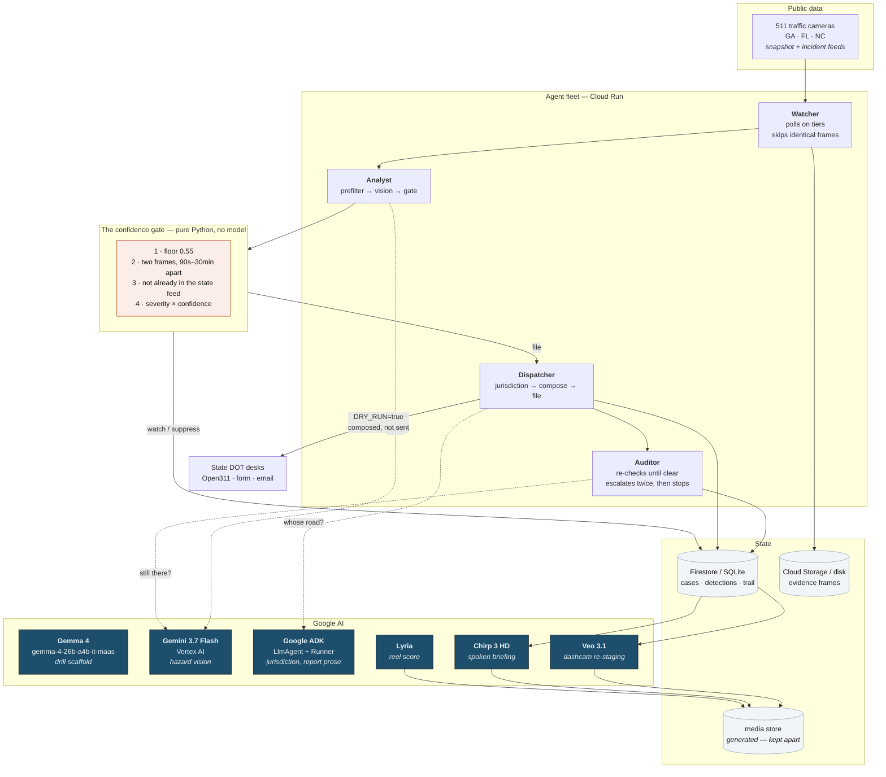
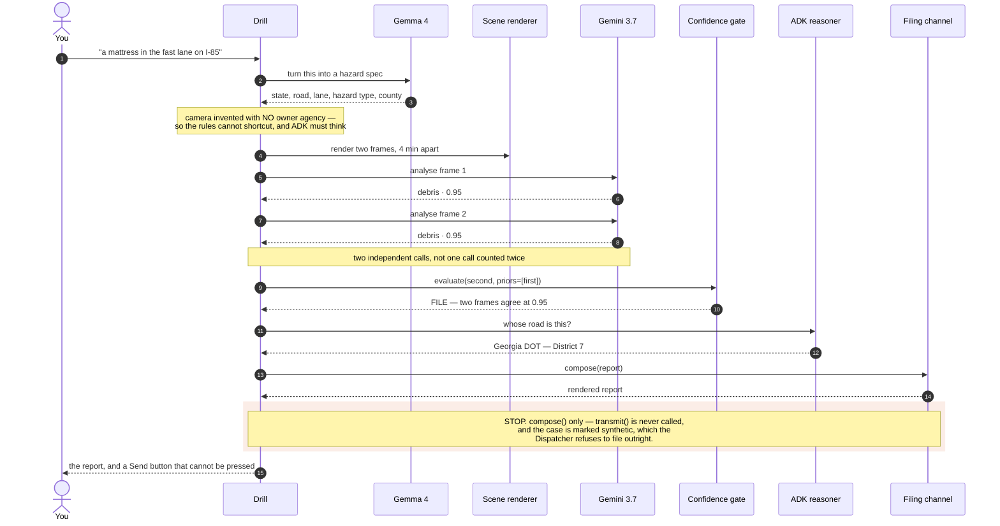
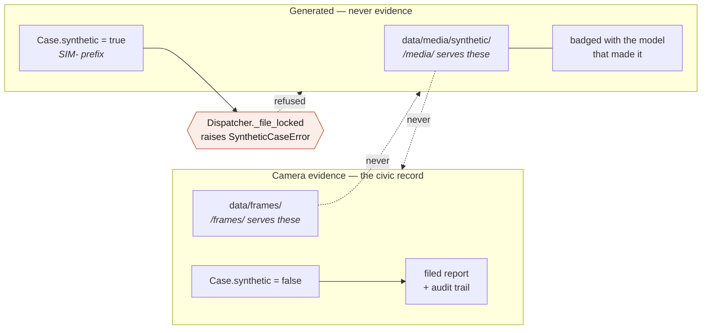

# Architecture diagram

Mermaid rather than an exported image: it renders on GitHub, it diffs in review,
and it cannot drift out of date behind a PNG nobody regenerated.

## The system

## One drill, end to end

What runs when you type a hazard into the console. Every box except the first
two is the same code a real camera detection goes through.

## Where the boundary sits

The one invariant worth drawing on its own: generated media and camera evidence
never mix, and nothing synthetic can reach an agency.

