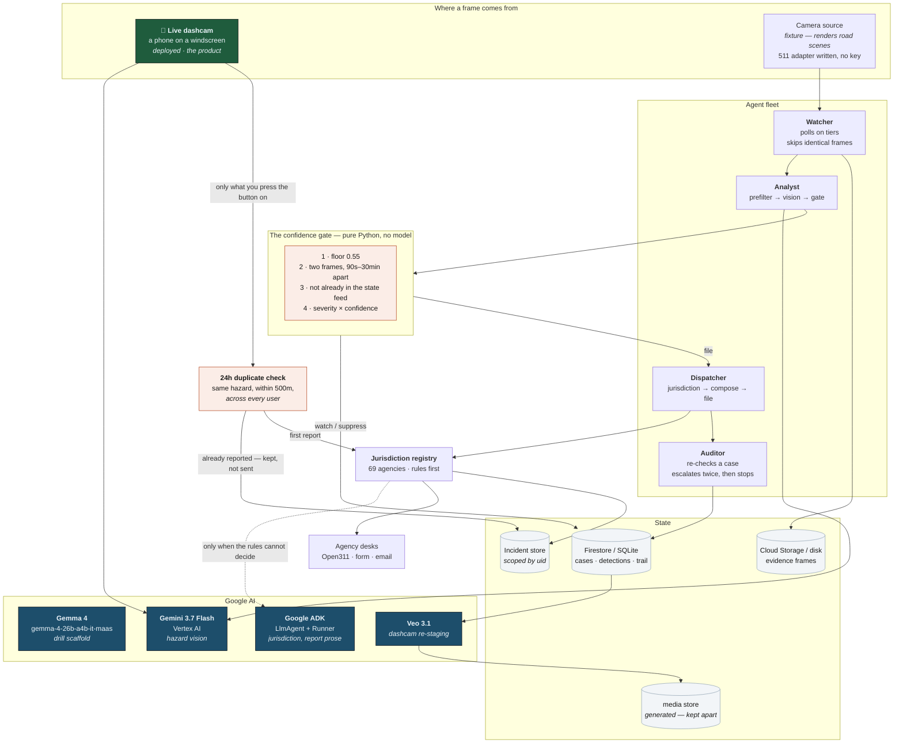
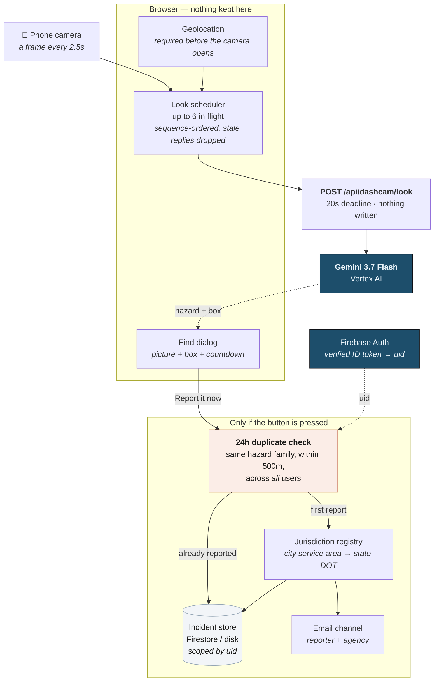
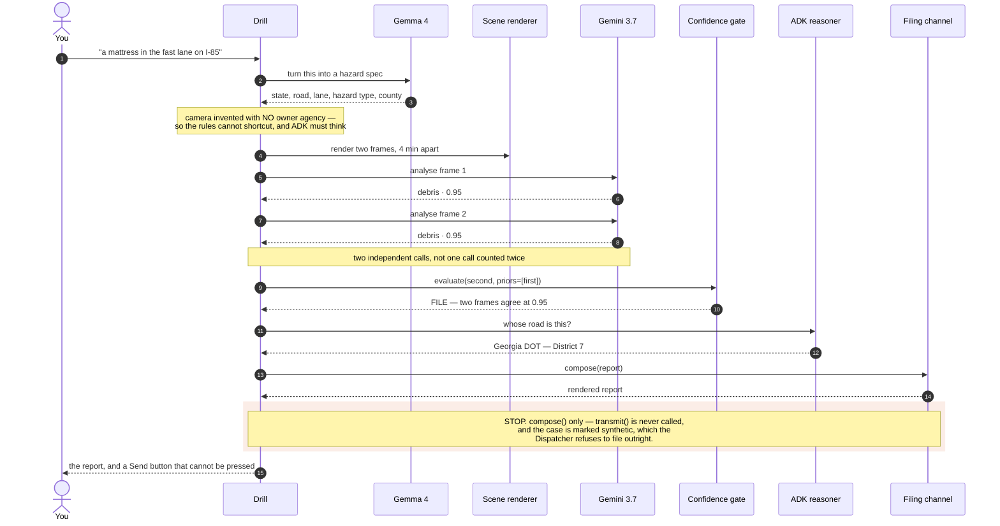
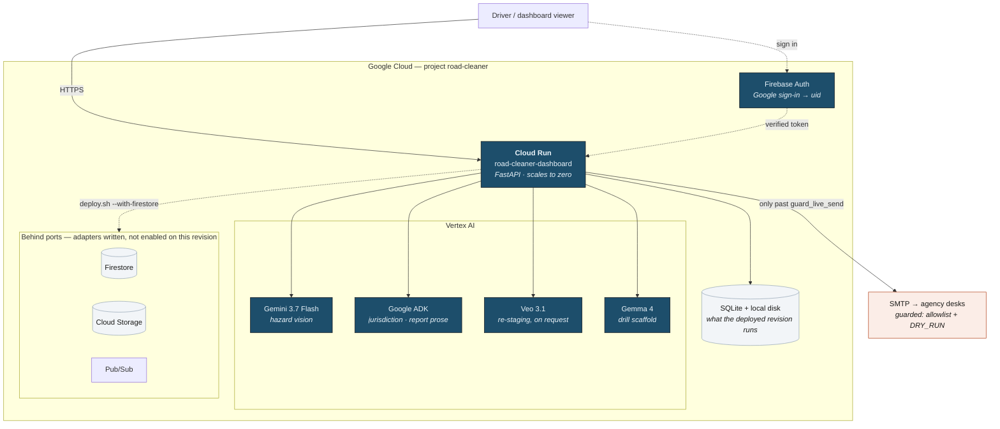
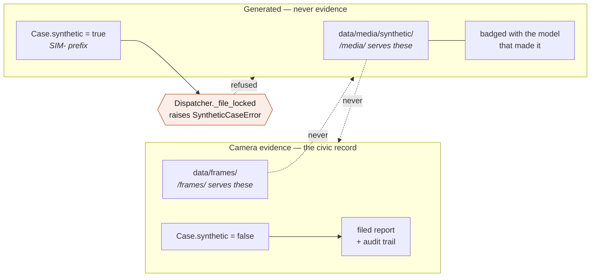

# Architecture diagram

Mermaid rather than an exported image: it renders on GitHub, it diffs in review,
and it cannot drift out of date behind a PNG nobody regenerated.

PNGs are generated *from* these blocks and live in [`img/`](img/), for places
that cannot render mermaid. They are a build artifact of this file, never the
source — regenerate them rather than editing them:

```bash
make diagrams        # docs/diagram.md -> docs/img/*.png
```

| | |
|---|---|
| [The system](img/01-system.png) | The four-agent fleet, end to end |
| [The dashcam path](img/02-dashcam.png) | A phone on a windscreen |
| [One drill](img/03-drill.png) | What runs when you type a hazard |
| [Deployment](img/04-deployment.png) | What runs where on Google Cloud |
| [The boundary](img/05-boundary.png) | Why synthetic media can never be filed |

## The system

Two ways a frame gets in, one pipeline behind them. The **live dashcam** is the
deployed product and what the demo shows; the agent fleet is the same pipeline
reading a camera source instead of a phone.

Be clear about that source, because the diagram used to overstate it: it is a
**fixture** that renders road scenes. The `Vendor511` adapter for the real GA /
FL / NC feeds is written and tested, but no developer key has ever been set, so
it has never run against a live feed. Everything downstream of the frame — the
gate, the jurisdiction registry, the report, the refusals — is the same code on
both paths.



## The second way in — a phone on a windscreen

The fleet above watches public cameras on a schedule. This is the other input:
a person driving, with the same model, the same gate vocabulary and the same
jurisdiction registry behind it. Nothing is stored unless they press the button.



Three things on that path are worth naming, because they are where the judgement
lives rather than the plumbing:

* **Every frame is discarded.** `/api/dashcam/look` writes nothing at all — no
  frame, no detection, no case. Only a find somebody actively reports is kept.
* **The duplicate check crosses users.** One pothole driven past by forty people
  is one email, not forty. It reads a projection — hazard type, coordinates,
  timestamp — never anybody's photograph or address.
* **A report needs coordinates or it does not go.** The camera will not open
  without location permission, because a crew cannot be sent to "somewhere".

## One drill, end to end

What runs when you type a hazard into the console. Every box except the first
two is the same code a real camera detection goes through.



## What runs where, on Google Cloud

The deployed shape. Every box marked *port* has a second implementation that
runs on a laptop with no credentials, which is why `make demo` works on a clean
clone — see [architecture.md](architecture.md).



## Where the boundary sits

The one invariant worth drawing on its own: generated media and camera evidence
never mix, and nothing synthetic can reach an agency.


